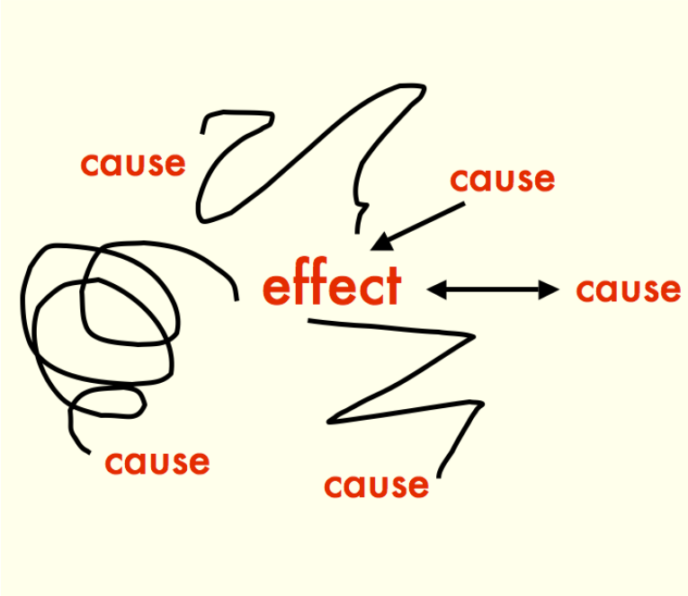

# Features Selection

## Too Many Features, No Good Model
We’re back at it again—yes, the same notorious context 😤: exploring insights through EDA and trying to make sense of 3,000 features. If that sounds overwhelming, it's because it absolutely is. I've already tried the usual techniques: correlation matrices with the target, feature importance plots 📊, and a few desperate methods. Yet, despite all of this, I’m still knee-deep in noisy and redundant features.  
In a moment of inspired recklessness (a.k.a. a stupid idea), I went ahead and trained a model using the selected features from my EDA. Shockingly, the model overfitted. It learned from the noise and refused to let go.  
So, what now? The last tool in the box ✨ — **Domain Knowledge**.  
We data scientists love our EDA, stats, and machine learning magic 🪄. But sometimes, we forget that our data lives in the real world—attached to a specific domain, purpose, and context. And if we want our models to not just perform but actually make sense, we have to reconnect with that domain.  
In this article, I’ll share how I approached feature selection this time around using nothing but domain expertise. No fancy algorithms—just context, common sense, and a bit of trial and error.  
**P.S.** Got your own secret sauce for feature selection using domain insights? Feel free ☺️ to add it in—this is a collaborative story, after all.  
  
## Features Selection Toolbox 📦
In the section, I will present the different techniques and tips that I have personally tried in my project in order to reduce the number of features :  
- **Experts Consultation** :  

  

Once you've defined the problem, framed it nicely, and planned a roadmap, don’t just go ahead into coding — go talk to the experts! They’re the ones who can point you toward the features that actually matter, saving you from drowning in irrelevant data. Say you're working on a project to predict the next best offer for a client; ask the marketing team. They'll guide you toward the right data, highlight the features worth your attention, and maybe even suggest some clever transformations to squeeze every insight from your dataset.  
  
- **Litterature Review** :

  

  
One of the most underrated — yet absolutely essential — techniques in any data science project is doing an old-fashioned literature review. Yes, it may not be veeeery exciting but trust me, it saves you from reinventing the wheel. By diving into past research, you can see what brilliant minds have already discovered in your area. For instance, if you're working on predicting the throughput of ADSL lines, dig into papers that explore DSL technology and the network metrics that influence performance. You might even find models that already tried to predict the same thing. This way, you get to learn from their mistakes without making them yourself!  
  
- **Causal Reasoning** :  

  

  
This technique usually comes after the first two — once you’ve gathered enough insights to make you feel comfortable with your data. Now it’s time to organize that information into graphs — not the bar chart kind, but more like causal diagrams (think: family trees for your variables). With causal reasoning, you map out the relationships between features and the target variable, helping you understand who’s influencing whom. By the time you’re done drawing this beautiful dependency tree, you’ll be able to tell which features are directly impacting your target, and which ones are just standing in the background pretending to be important.  
  
- **Dimensional Grouping** :  

  

  
Sometimes you might handpick a few seemingly important features, only to realize they’re basically saying the same thing in different outfits — what is called multicollinearity. When multiple features are highly correlated, using them all can confuse your model more than it helps. In this case, it’s often better to group or combine them into a smaller set of features that capture the same underlying information, but without the redundancy.  
Although this technique leans more toward feature engineering than pure feature selection — which is our main topic — it's still highly relevant. Reducing dimensionality through grouping helps simplify your feature space, improve model performance, and make your insights cleaner and easier to interpret.  
  
- **Avoid Some Pitfalls** :  

  

  
Even with the best intentions, it's easy to fall into some classic traps during feature selection — and they can quietly sabotage your model’s performance. Here are two of the most common (and misleading) ones to avoid:  
  
1. *Don’t Use Proxies for the Outcome* :  
Using a variable that indirectly reflects your target outcome might seem helpful at first, but it can lead to misleadingly high accuracy and low real-world usefulness. For example, imagine you're building a model to predict patient recovery. Including hospital stay length might sound useful — after all, longer stays probably mean slower recovery. The problem here is, that hospital stay length is a consequence of recovery, not a predictor. You’re not modeling recovery — you're just reverse-engineering the outcome using something that already knows it.
2. *Exclude Post-Treatment Variables in Causal Models* :  
If you're modeling causal effects — say, the impact of a new treatment on patient recovery — you should not include variables that are affected by the treatment itself. These are called post-treatment variables, and including them is like bringing spoilers to the model.
