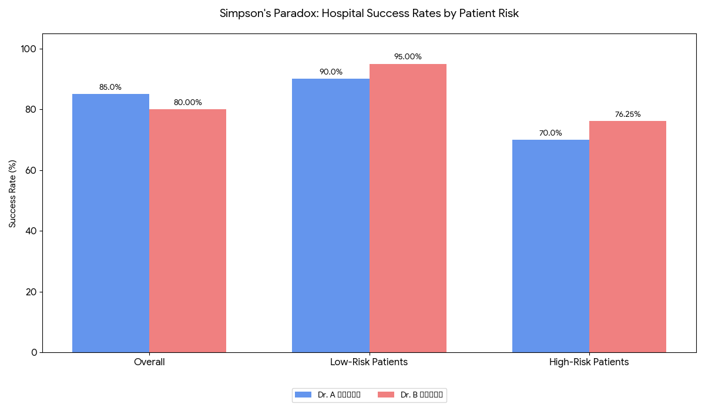

# The Simpson Paradox

## The 'aha!' moment
Picture this: You're a month deep into EDA for an ML project, riding high on satisfying results and clear insights. Life is good and everything's under control.  
Then reality hits. You're staring at over 3000 features 🤯 (because apparently someone thought more is always better), and you decide it's time for some feature spring cleaning. Simple enough, right? Just calculate some correlations between features and your target variable and pick the winners.  
That's when something weird happened 🧐.  
I'm looking at my correlation results, and something feels... off. The overall correlation between a key feature and my target variable told one story. But when I split my binary classification data into its two classes and looked at the correlations within each group, it was like I was looking at a completely different dataset. The numbers weren't just different—they were telling the opposite story.
I stared at my screen for a solid ten minutes. After triple-checking my work and questioning my basic math skills, I realized I'd encountered something I'd never seen before in practice: **Simpson's Paradox**.  
That moment made me realize how many statistical traps are lurking in our day-to-day ML work, ready to lead us to completely wrong conclusions.  
I did some research and found plenty of articles about Simpson's Paradox. They were all interesting and educational 🤓, but most seemed to love the classic Berkeley admissions example a little too much 😔. What I couldn't find was someone saying "Here's how you actually deal with this when it crashes your Tuesday afternoon and you have a deadline on Friday."
So I decided to write that article myself.

## 🕵️‍♂️ Simpson's Paradox: The Reason Your Data Has Trust Issues
Imagine you have two doctors: Doctor A 👩🏼‍⚕️ and Doctor B 🧑🏼‍⚕️. They perform the same type of surgeries. Let's have a look at their success rate:  

  
**In more serious terms**, Simpson’s Paradox occurs when a trend that appears in several separate groups of data reverses or disappears when the groups are combined.  
  
## Why Numbers Sometimes Lie 🤥?  
The surprising reversal in success rates between Dr. A 👩🏼‍⚕️ and Dr. B 🧑🏼‍⚕️ — where Dr. A seems better overall, but Dr. B is better in every patient category — happens because of two main effects:  
  
**Group Sizes Aren’t Equal — and That Matters! ⚖️**  
Remember how Dr. A 👩🏼‍⚕️ treats equal 400 patients total (200 low-risk and 200 high-risk). Dr. B 🧑🏼‍⚕️, on the other hand, treats 700 patients, but mostly low-risk.  
When you combine the data, the large difference in group sizes means Dr. B 🧑🏼‍⚕️’s many low-risk patients heavily influence the overall success rate, even though Dr. A 👩🏼‍⚕️ performs better in each group.  
It’s like comparing two baskets apples and oranges — except one basket has way more apples, so your overall “fruit score” is somehow biased toward apples.  
  
**The Lurking Variable Can Have a Big Impact 🎭**  
The “lurking variable” here is patient risk level (low-risk vs. high-risk). It has a huge effect on surgery success rates — low-risk patients naturally have better outcomes than high-risk patients.  
Ignoring this lurking variable and just looking at combined success rates hides the **BIG** picture.

## How to Outsmart Sneaky Stats 🔎??
Hold up! Before we jump into "fixing" Simpson’s Paradox, there’s something important you should know: it’s not a bug — it’s a feature. 🐞✨.  
Simpson’s Paradox isn’t actually a problem that needs solving. It’s a paradox, which is just another way of saying “your brain is confused because math is sneakier than expected.” So instead of trying to fix an illusional problem, we need to rethink how we look at the data. The real question is:  
**🤔 Should we split the data into groups (segregate), or lump it all together (aggregate)?**  
To make that decision wisely, we need to start thinking like detectives: **Think Causally 🕵️‍♂️** Ask the appropriate question to have right answers: What’s really affecting what? Is that third variable (the "lurker") actually influencing the outcome?  
Let’s break this down with a question that started the whole statistical paradox:  
We noticed that the overall correlation between a feature and the target looked pretty different when we split the data by class. So now we ask the million-dollar question: **Should we trust the correlation from the full dataset, or the ones from the separate groups?**  
Honestly, it depends. But in my case, I decided to keep things simple—and my brain intact 🧠💡. Here’s my common-sense (and mildly lazy) rule for deciding which features to keep:  
1. If a feature shows stronger correlation with the target in one class than the other, that’s a good sign! It means the feature might actually help distinguish between the two groups. 🎯
2. Also, the overall correlation should still be pretty significant — because if it’s not making noise in the big picture, it’s probably just background static.  
In short: Keep the features that scream "I'm useful!" **both globally and locally**.